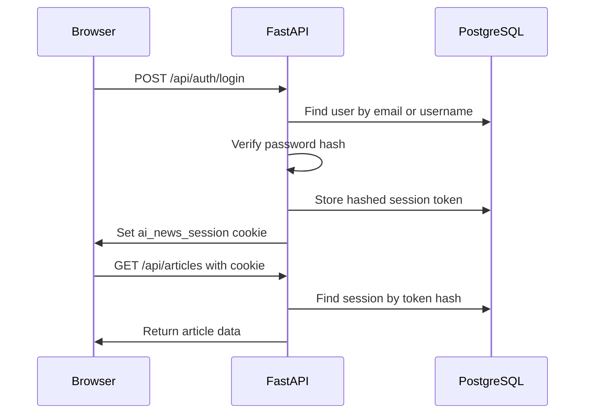

# API Documentation

## API Overview

The API is built with FastAPI in `app/api.py`.

The frontend calls these endpoints with browser `fetch`. Auth uses an HTTP-only cookie named `ai_news_session`.

Base local URL:

```text
http://localhost:8000
```

## Authentication Rules

There are three access levels:

| Access Level | Meaning |
| --- | --- |
| Public | Anyone can call it |
| Logged in | Must have a valid session cookie |
| Super User | Must be logged in and have `role = super_user` |

## Frontend Page

### `GET /`

Serves `frontend/static-desing.html`.

Access: public.

Response: HTML page.

## Auth Endpoints

### `POST /api/auth/signup`

Creates an account and logs the user in.

Access: public.

Request:

```json
{
  "email": "alex@example.com",
  "username": "alex_ai",
  "password": "Password123"
}
```

Response:

```json
{
  "user": {
    "id": "user-id",
    "email": "alex@example.com",
    "username": "alex_ai",
    "role": "normal_user",
    "is_active": true
  }
}
```

Notes:

- Password must be at least 8 characters.
- Password must include at least one letter and one number.
- New users are always `normal_user`.
- The response also sets the HTTP-only session cookie.

### `POST /api/auth/login`

Logs in with email or username.

Access: public.

Request:

```json
{
  "identifier": "alex@example.com",
  "password": "Password123"
}
```

Response:

```json
{
  "user": {
    "id": "user-id",
    "email": "alex@example.com",
    "username": "alex_ai",
    "role": "normal_user",
    "is_active": true
  }
}
```

Possible errors:

- `401 Unauthorized`: wrong email, username, or password.
- `403 Forbidden`: account is deactivated.

### `GET /api/auth/me`

Returns the current logged-in user.

Access: logged in.

Response:

```json
{
  "user": {
    "id": "user-id",
    "email": "alex@example.com",
    "username": "alex_ai",
    "role": "super_user",
    "is_active": true
  }
}
```

Possible errors:

- `401 Unauthorized`: missing, invalid, or expired session.
- `403 Forbidden`: deactivated account.

### `POST /api/auth/logout`

Logs out the current user.

Access: public, but only does session revocation if the session cookie exists.

Response:

```json
{
  "message": "Logged out"
}
```

## Article Endpoint

### `GET /api/articles`

Returns digest cards for the dashboard.

Access: logged in.

Response:

```json
{
  "articles": [
    {
      "id": "openai:https://example.com/article",
      "category": "openai",
      "title": "Short digest title",
      "description": "Two or three sentence summary.",
      "date": "14/05/2026",
      "source": "OpenAI",
      "url": "https://example.com/article",
      "image_url": null
    }
  ]
}
```

Notes:

- YouTube items get thumbnail URLs from `img.youtube.com`.
- Results are ordered by newest digest first.

## Pipeline Endpoints

### `POST /api/pipeline/run`

Starts the full news pipeline in a FastAPI background task.

Access: Super User.

Response:

```json
{
  "message": "Pipeline execution started",
  "status": "running",
  "run_id": "pipeline-run-id"
}
```

If a run is already active:

```json
{
  "message": "Pipeline is already running",
  "status": "running",
  "run_id": "pipeline-run-id"
}
```

Possible errors:

- `401 Unauthorized`: not logged in.
- `403 Forbidden`: logged in but not a Super User.

### `GET /api/pipeline/status`

Returns current in-memory pipeline status.

Access: Super User.

Response:

```json
{
  "status": "idle",
  "last_run": {
    "success": true,
    "duration_seconds": 42.5
  },
  "error": null,
  "current_run_id": null
}
```

## Admin Endpoints

All `/api/admin/*` endpoints require Super User access.

### `GET /api/admin/summary`

Returns summary cards for the Admin Panel.

Response:

```json
{
  "users": {
    "total": 3,
    "active": 3,
    "super_users": 1
  },
  "content": {
    "digests": 20,
    "sources": {
      "youtube": 7,
      "openai": 8,
      "anthropic": 5
    }
  },
  "pipeline": {
    "status": {
      "status": "idle",
      "last_run": null,
      "error": null,
      "current_run_id": null
    },
    "latest_run": null
  }
}
```

### `GET /api/admin/users`

Lists all users.

Response:

```json
{
  "users": [
    {
      "id": "user-id",
      "email": "alex@example.com",
      "username": "alex_ai",
      "role": "super_user",
      "is_active": true,
      "created_at": "2026-05-14T10:00:00",
      "updated_at": "2026-05-14T10:00:00"
    }
  ]
}
```

### `PATCH /api/admin/users/{user_id}`

Updates a user's role or active status.

Request:

```json
{
  "role": "super_user",
  "is_active": true
}
```

You can send one field or both.

Response:

```json
{
  "user": {
    "id": "user-id",
    "email": "alex@example.com",
    "username": "alex_ai",
    "role": "super_user",
    "is_active": true,
    "created_at": "2026-05-14T10:00:00",
    "updated_at": "2026-05-14T10:05:00"
  },
  "changes": {
    "role": {
      "from": "normal_user",
      "to": "super_user"
    }
  }
}
```

Safety rules:

- A Super User cannot remove their own Super User access.
- A Super User cannot deactivate their own account.
- The app prevents removing the last active Super User.

### `GET /api/admin/pipeline/runs`

Lists recent pipeline runs.

Response:

```json
{
  "runs": [
    {
      "id": "run-id",
      "status": "success",
      "triggered_by": "admin",
      "triggered_by_email": "admin@example.com",
      "started_at": "2026-05-14T10:00:00",
      "finished_at": "2026-05-14T10:02:00",
      "duration_seconds": 120.0,
      "result": {
        "success": true
      },
      "error": null
    }
  ]
}
```

### `GET /api/admin/audit-logs`

Lists recent admin actions.

Response:

```json
{
  "logs": [
    {
      "id": "log-id",
      "actor": "admin",
      "actor_email": "admin@example.com",
      "action": "user.update",
      "target_type": "user",
      "target_id": "user-id",
      "details": {
        "role": {
          "from": "normal_user",
          "to": "super_user"
        }
      },
      "created_at": "2026-05-14T10:05:00"
    }
  ]
}
```

## Authentication Flow Diagram



## Common Status Codes

| Code | Meaning |
| --- | --- |
| `200` | Request worked |
| `201` | Created successfully |
| `400` | Bad request data |
| `401` | Not logged in or invalid session |
| `403` | Logged in but not allowed |
| `404` | Resource not found |
| `409` | Duplicate email or username |
| `500` | Server error |
