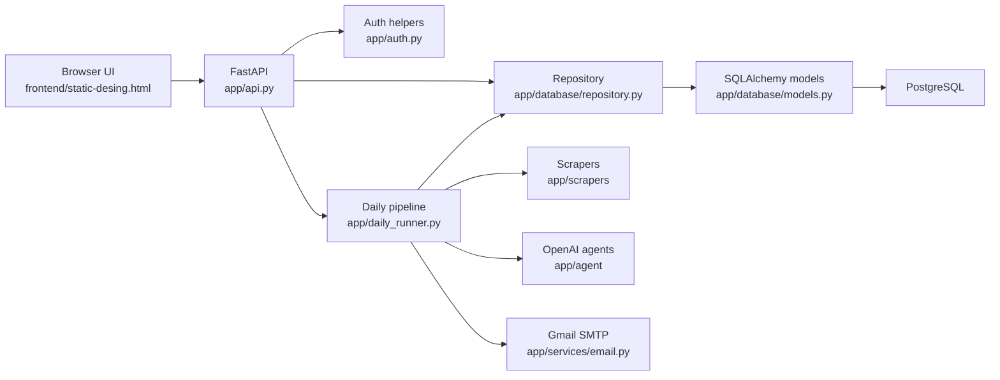
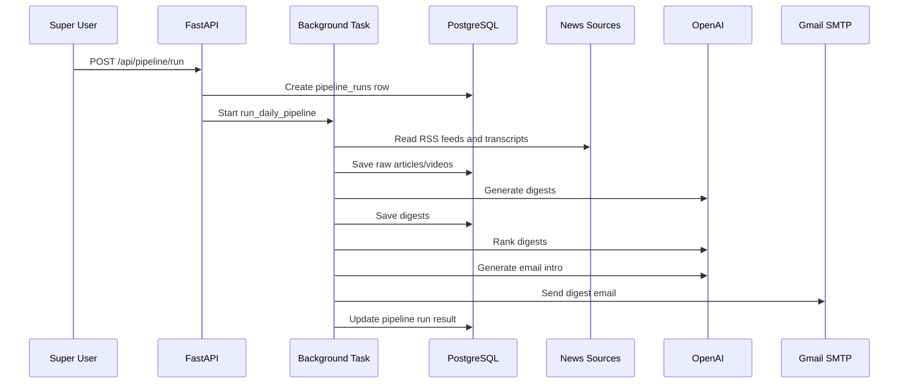

# Architecture

## Simple Architecture Summary

The project is a monolithic Python web application. "Monolithic" means the API, pipeline, database access, and UI serving live in one codebase instead of many separate services.

The browser talks to FastAPI. FastAPI reads and writes PostgreSQL. The pipeline talks to external news sources, OpenAI, YouTube transcript APIs, and Gmail SMTP.

## System Diagram

## Main Layers

### 1. Frontend Layer

File: `frontend/static-desing.html`

This is a single HTML file with:

- CSS theme.
- Login and signup screen.
- News dashboard.
- Admin Panel.
- JavaScript that calls backend APIs with `fetch`.

FastAPI serves this file at `/`.

### 2. API Layer

File: `app/api.py`

This layer exposes HTTP endpoints:

- Auth endpoints: signup, login, current user, logout.
- Article endpoint: dashboard news list.
- Pipeline endpoints: run and status.
- Admin endpoints: users, stats, audit logs, pipeline history.

### 3. Authentication Layer

File: `app/auth.py`

This layer handles:

- Password hashing.
- Password verification.
- Session token creation.
- Cookie setup.
- Current user lookup.
- Super User authorization.

### 4. Database Layer

Files:

- `app/database/connection.py`
- `app/database/models.py`
- `app/database/repository.py`
- `app/database/migrations.py`
- `app/database/create_tables.py`

This layer connects to PostgreSQL and stores:

- Users and sessions.
- Raw articles and videos.
- Digests.
- Pipeline run history.
- Audit logs.

### 5. Scraper Layer

Files:

- `app/scrapers/youtube.py`
- `app/scrapers/openai.py`
- `app/scrapers/anthropic.py`

This layer collects source content from RSS feeds and external APIs.

### 6. LLM Agent Layer

Files:

- `app/agent/digest_agent.py`
- `app/agent/curator_agent.py`
- `app/agent/email_agent.py`

This layer sends prompts to OpenAI and parses structured results into Pydantic models.

### 7. Service Layer

Files:

- `app/services/process_youtube.py`
- `app/services/process_anthropic.py`
- `app/services/process_digest.py`
- `app/services/process_curator.py`
- `app/services/process_email.py`
- `app/services/email.py`

This layer performs business steps, such as processing transcripts, generating digests, and sending email.

## End-to-End Data Flow

## Important Design Choices

- The app uses first-party session cookies instead of JWTs.
- Session tokens are stored hashed in the database.
- Only Super Users can run the pipeline.
- Admin changes are stored in `audit_logs`.
- Pipeline history is stored in `pipeline_runs`.
- There is no external queue system. FastAPI `BackgroundTasks` runs the pipeline in the app process.
- There is no Alembic setup. A small idempotent migration helper handles the current RBAC upgrade.

## Current Limitations

- Background jobs run inside the FastAPI process. If the process stops, a running job stops too.
- Pipeline status also has an in-memory part, so live status resets when the server restarts.
- The frontend is one large HTML file. It is simple to deploy, but can become harder to maintain as features grow.
- There is no automated test suite yet.
