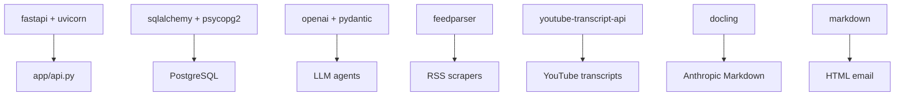

# Dependencies

This page explains the important Python packages used in the project.

Dependencies are listed in:

```text
pyproject.toml
```

## Main Dependencies

### `fastapi`

Used for:

- HTTP API routes.
- Request and response handling.
- Dependency injection.
- Background tasks.

Important file:

- `app/api.py`

### `uvicorn`

Used for:

- Running the FastAPI app locally.

Command:

```bash
python -m uvicorn app.api:app --reload
```

### `sqlalchemy`

Used for:

- ORM models.
- Database sessions.
- Queries.
- Inserts and updates.

Important files:

- `app/database/models.py`
- `app/database/repository.py`
- `app/database/connection.py`

### `psycopg2-binary`

Used for:

- PostgreSQL driver.

SQLAlchemy uses it to talk to PostgreSQL.

### `python-dotenv`

Used for:

- Loading `.env` variables into Python.

Important usage:

```python
from dotenv import load_dotenv
load_dotenv()
```

### `openai`

Used for:

- Calling OpenAI models.
- Parsing structured LLM responses.

Important files:

- `app/agent/digest_agent.py`
- `app/agent/curator_agent.py`
- `app/agent/email_agent.py`

### `pydantic`

Used for:

- API request models.
- Scraper result models.
- OpenAI structured response schemas.

Examples:

- `SignupRequest`
- `DigestOutput`
- `RankedDigestList`
- `EmailIntroduction`

### `feedparser`

Used for:

- Reading RSS feeds.

Important scrapers:

- YouTube RSS.
- OpenAI News RSS.
- Anthropic RSS feeds.

### `youtube-transcript-api`

Used for:

- Fetching YouTube video transcripts.

Important file:

- `app/scrapers/youtube.py`

### `docling`

Used for:

- Converting article URLs into Markdown.

Important file:

- `app/scrapers/anthropic.py`

### `markdown`

Used for:

- Converting email Markdown into HTML.

Important file:

- `app/services/email.py`

### `requests`, `beautifulsoup4`, `markdownify`

These are installed but not heavily used in the current main flow.

They are useful for future scraping or HTML-to-Markdown work.

## Development Dependencies

### `ipykernel`

Used for:

- Running notebooks or interactive Python work during development.

## External Services

| Service | Used For |
| --- | --- |
| OpenAI API | Summaries, ranking, email introduction |
| YouTube RSS | New video discovery |
| YouTube transcript API | Transcript fetching |
| OpenAI RSS | OpenAI article discovery |
| Anthropic RSS mirrors | Anthropic article discovery |
| Gmail SMTP | Sending email digests |
| PostgreSQL | Persistent database |

## Dependency Flow


