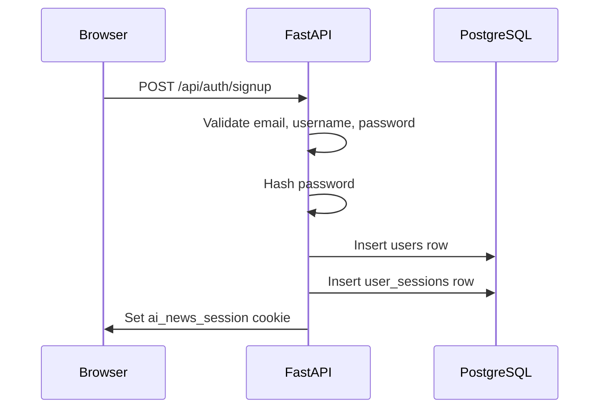
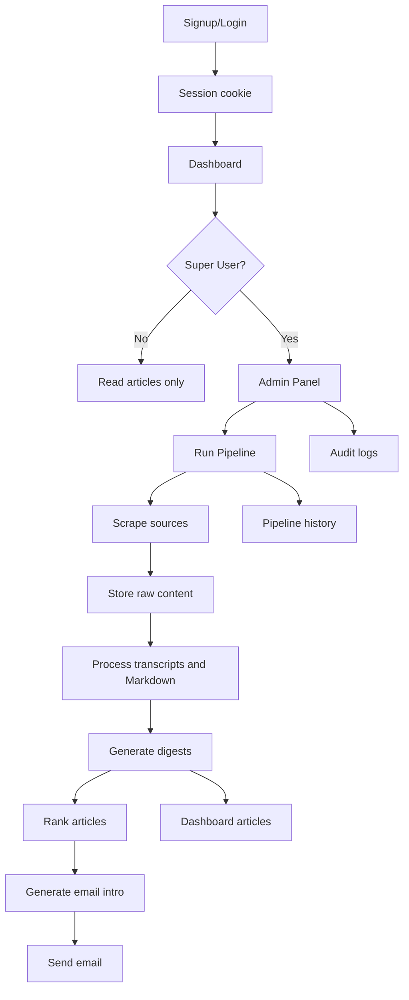

# End-to-End Workflow

This page explains the full app journey from a new user to a completed news digest.

## 1. User Creates Account



New accounts are normal users.

## 2. First Super User Is Created

After signup, run:

```bash
python -m app.scripts.promote_super_user your-email@example.com
```

The script:

1. Finds user by email or username.
2. Asks for that account's password.
3. Verifies the password.
4. Sets `role = super_user`.
5. Sets `is_active = true`.

## 3. Super User Starts Pipeline

From the Admin Panel:

```text
POST /api/pipeline/run
```

The backend:

1. Checks the session.
2. Checks Super User role.
3. Creates a `pipeline_runs` row.
4. Creates an audit log.
5. Starts a background task.

## 4. Pipeline Scrapes Sources

`run_daily_pipeline()` calls:

```python
run_scrapers(hours=hours)
```

This collects:

- YouTube videos.
- OpenAI articles.
- Anthropic articles.

New items are saved to source tables.

## 5. Pipeline Adds More Content

The pipeline then fills missing content:

- YouTube transcripts.
- Anthropic Markdown.

OpenAI articles currently use their RSS descriptions as content.

## 6. Pipeline Generates Digests

The digest service finds source items without a digest.

For each item:

1. Send title and content to OpenAI.
2. Receive structured title and summary.
3. Save a row in `digests`.

## 7. Pipeline Ranks Digests

The email service gets recent digests and sends them to `CuratorAgent`.

The LLM ranks them using:

- User interests.
- User background.
- Expertise level.
- Preferences.

## 8. Pipeline Sends Email

The top ranked articles are sent to `EmailAgent`.

The app creates:

- Plain text Markdown.
- HTML email.

Then `send_email()` sends the message through Gmail SMTP.

## 9. Dashboard Displays Digests

The browser calls:

```text
GET /api/articles
```

FastAPI reads from `digests` and returns card data.

The frontend displays:

- Title.
- Summary.
- Date.
- Source.
- Link.
- YouTube thumbnail when available.

## Complete Flow Diagram


