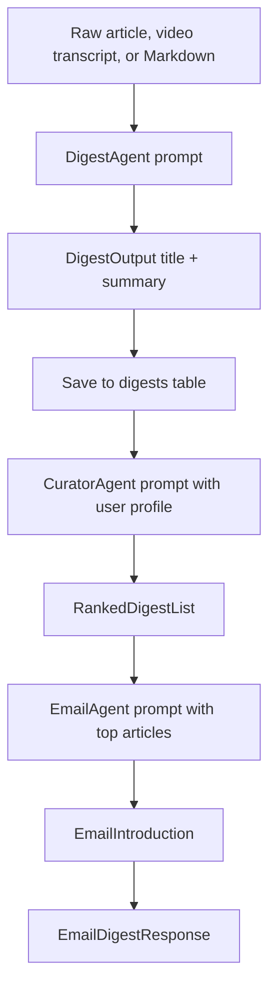

# OpenAI and LLM Integration

## LLM Overview

The app uses OpenAI models for three tasks:

1. Create short article digests.
2. Rank digests for a user profile.
3. Write the email introduction.

The OpenAI code is in:

- `app/agent/digest_agent.py`
- `app/agent/curator_agent.py`
- `app/agent/email_agent.py`

The app uses the OpenAI Responses API through the `openai` Python package.

## Model Configuration

All three agents currently use:

```python
self.model = "gpt-4.1"
```

Each agent creates a client like this:

```python
self.client = OpenAI(api_key=os.getenv("OPENAI_API_KEY"))
```

So the model key comes from the `.env` variable:

```env
OPENAI_API_KEY=your-api-key
```

## Structured Output

The agents use Pydantic models as response formats.

This means the LLM is asked to return data that matches a Python schema, not loose text.

Example from the digest agent:

```python
class DigestOutput(BaseModel):
    title: str
    summary: str
```

The API call uses:

```python
response = self.client.responses.parse(
    model=self.model,
    instructions=self.system_prompt,
    temperature=0.7,
    input=user_prompt,
    text_format=DigestOutput
)
```

Then the parsed result is read with:

```python
response.output_parsed
```

## Where LLMs Are Used

### 1. Digest Generation

File: `app/agent/digest_agent.py`

Called by:

- `app/services/process_digest.py`

Purpose:

- Convert a long article, transcript, or Markdown page into:
  - a short title
  - a short summary

Input:

- Source title.
- Source content.
- Source type, for example `youtube`, `openai`, or `anthropic`.

Output:

```json
{
  "title": "Short digest title",
  "summary": "Two or three sentence summary."
}
```

Prompt behavior:

- The system prompt tells the model to act as an expert AI news analyst.
- It asks for clear, useful, non-hype summaries.
- The content is trimmed to the first 8000 characters:

```python
content[:8000]
```

This is a simple token-control strategy. It prevents very long source content from being sent in full.

Temperature:

```python
temperature=0.7
```

This allows a bit more writing style variation.

### 2. Digest Ranking

File: `app/agent/curator_agent.py`

Called by:

- `app/services/process_curator.py`
- `app/services/process_email.py`

Purpose:

- Rank recent digests based on a user profile.

The user profile is stored in:

- `app/profiles/user_profile.py`

The model receives:

- User name.
- Background.
- Expertise level.
- Interests.
- Preferences.
- Recent digests.

Output schema:

```json
{
  "articles": [
    {
      "digest_id": "youtube:video-id",
      "relevance_score": 9.2,
      "rank": 1,
      "reasoning": "Why this article is relevant"
    }
  ]
}
```

Temperature:

```python
temperature=0.3
```

This is lower because ranking should be more consistent and less creative.

### 3. Email Introduction

File: `app/agent/email_agent.py`

Called by:

- `app/services/process_email.py`

Purpose:

- Create a friendly greeting and short email introduction for the top ranked articles.

Output schema:

```json
{
  "greeting": "Hey Dave, here is your daily digest...",
  "introduction": "Short overview of today's themes..."
}
```

Temperature:

```python
temperature=0.7
```

This allows more natural writing.

## Prompt Flow Diagram



## Token Handling

The project does not calculate exact token counts.

Current token-related behavior:

- Digest content is trimmed to `content[:8000]`.
- Ranking sends digest summaries instead of full article text.
- Email introduction sends only top article titles and scores.

This keeps prompts smaller and cheaper than sending all raw content every time.

## Response Processing

The app uses `responses.parse`, so successful responses become Pydantic objects.

If an LLM call fails:

- The digest agent prints the error and returns `None`.
- The curator agent prints the error and returns an empty list.
- The email agent prints the error and returns a fallback introduction.

## Failure Behavior

| Component | Failure Result |
| --- | --- |
| Digest generation | Article is counted as failed |
| Ranking | Email generation fails because no ranked articles are available |
| Email intro generation | A fallback intro is used |

## API Usage Summary

The app uses:

- `OpenAI(api_key=...)`
- `client.responses.parse(...)`
- Pydantic response models

It does not currently use:

- Streaming responses.
- Embeddings.
- Vector databases.
- Fine-tuned models.
- Tool calling.

## Security Notes

- Never commit `OPENAI_API_KEY`.
- Keep `.env` local.
- Avoid logging raw secret values.
- Be careful when sending private or sensitive source content to an LLM.

## How To Change The Model

Change the `self.model` value in:

- `DigestAgent`
- `CuratorAgent`
- `EmailAgent`

Example:

```python
self.model = "gpt-4.1"
```

If you change models, test:

- Digest format.
- Ranking format.
- Email intro fallback.
- Cost and latency.
