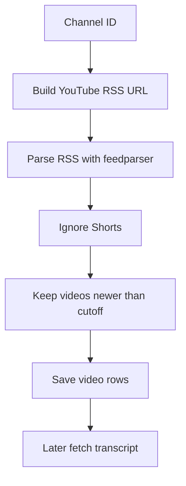
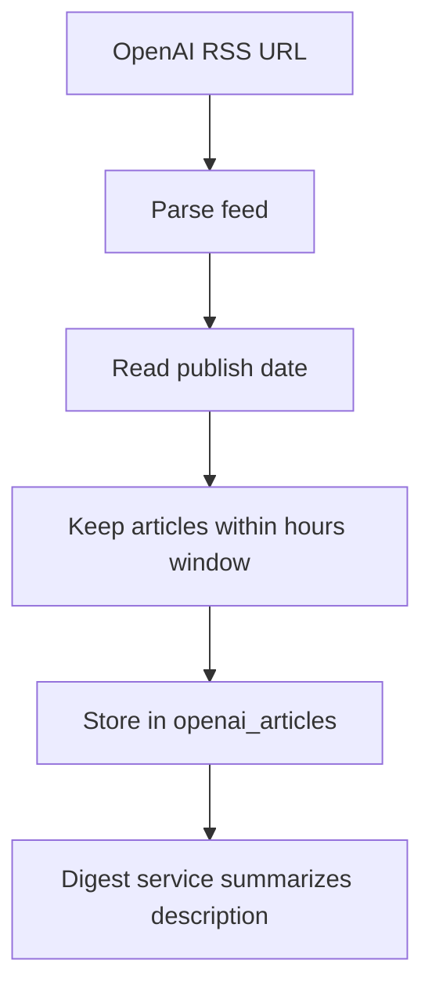
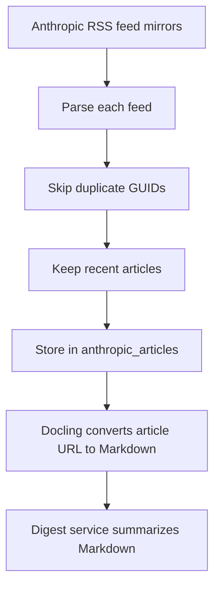

# News Providers and Sources

## Provider Overview

The app collects AI news from three source groups:

1. YouTube channels.
2. OpenAI News RSS.
3. Anthropic RSS feed mirrors.

Scraper files live in:

- `app/scrapers/youtube.py`
- `app/scrapers/openai.py`
- `app/scrapers/anthropic.py`

The scraper orchestrator lives in:

- `app/runner.py`

## Source List

| Provider | Source Type | Purpose |
| --- | --- | --- |
| YouTube | Channel RSS feeds and transcript API | Collect videos and transcript text |
| OpenAI | Official OpenAI News RSS | Collect OpenAI articles |
| Anthropic | RSS feed mirror URLs | Collect Anthropic news, research, and engineering posts |

## YouTube Provider

File: `app/scrapers/youtube.py`

### Configuration

YouTube channel IDs are configured in:

```python
app/config.py
```

Current channels:

| Channel ID | Comment in config |
| --- | --- |
| `UCn8ujwUInbJkBhffxqAPBVQ` | Dave Ebbelaar |
| `UCawZsQWqfGSbCI5yjkdVkTA` | Matthew Berman |
| `UC5LTm52VaiV-5Q3C-txWVGQ` | ai revolution |

### Integration Flow



### RSS URL Format

The app builds URLs like:

```text
https://www.youtube.com/feeds/videos.xml?channel_id=CHANNEL_ID
```

### Transcript Handling

The app uses `youtube-transcript-api`.

If transcripts are disabled or missing:

- `get_transcript()` returns `None`.
- `process_youtube_transcripts()` stores `__UNAVAILABLE__`.

This prevents retrying the same unavailable transcript forever.

### Optional Proxy

The YouTube scraper supports Webshare proxy credentials:

```env
PROXY_USERNAME=
PROXY_PASSWORD=
```

These variables are optional. They are useful if transcript requests are blocked or rate limited.

## OpenAI Provider

File: `app/scrapers/openai.py`

### Source

```text
https://openai.com/news/rss.xml
```

### Purpose

Collects articles from OpenAI News.

### Integration Flow



### Stored Fields

- `guid`
- `title`
- `description`
- `url`
- `published_at`
- `category`

## Anthropic Provider

File: `app/scrapers/anthropic.py`

### Sources

The app uses feed mirror URLs:

```text
https://raw.githubusercontent.com/Olshansk/rss-feeds/main/feeds/feed_anthropic_news.xml
https://raw.githubusercontent.com/Olshansk/rss-feeds/main/feeds/feed_anthropic_research.xml
https://raw.githubusercontent.com/Olshansk/rss-feeds/main/feeds/feed_anthropic_engineering.xml
```

### Purpose

Collects Anthropic news, research, and engineering posts.

### Integration Flow



### Markdown Conversion

Anthropic article pages are converted with Docling:

```python
result = self.converter.convert(url)
return result.document.export_to_markdown()
```

The Markdown is saved in `anthropic_articles.markdown`.

## Adding a New Provider

To add a new source:

1. Create a scraper in `app/scrapers/`.
2. Add a database model if the source needs its own table.
3. Add repository methods for insert and lookup.
4. Update `app/runner.py` to call the scraper.
5. Update `get_articles_without_digest()` so digest generation can find the new source.
6. Update frontend category display if you want a new tab or badge.

## Provider Failure Behavior

| Provider | Common Failure | Current Behavior |
| --- | --- | --- |
| YouTube RSS | Feed unavailable | Returns empty list |
| YouTube transcript | Transcript missing | Stores `__UNAVAILABLE__` |
| OpenAI RSS | Feed unavailable | Returns empty list |
| Anthropic RSS | One feed unavailable | Continues with other feeds |
| Anthropic page conversion | Docling conversion fails | Markdown is not saved |

## Data Deduplication

The repository avoids duplicate inserts:

- YouTube checks `video_id`.
- OpenAI checks `guid`.
- Anthropic checks `guid`.
- Digests use ID format `article_type:article_id`.

This lets the pipeline run multiple times without creating duplicate rows.
