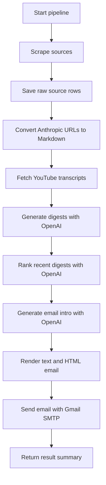

# Pipeline and Background Jobs

## Pipeline Overview

The main pipeline is defined in:

- `app/daily_runner.py`

It runs these steps:

1. Scrape new articles and videos.
2. Process Anthropic pages into Markdown.
3. Process YouTube transcripts.
4. Generate digests with OpenAI.
5. Rank digests and send an email digest.

## Pipeline Diagram



## Running The Pipeline

### From Python CLI

```bash
python main.py
```

With custom values:

```bash
python main.py 24 10
```

Meaning:

- `24`: look back 24 hours.
- `10`: include top 10 articles in the email.

### From The Web UI

Super Users can click `Run Pipeline`.

That calls:

```text
POST /api/pipeline/run
```

The API starts a FastAPI background task.

## Background Jobs

The app uses FastAPI `BackgroundTasks`.

Important file:

- `app/api.py`

Important function:

- `run_pipeline_task(run_id)`

What happens:

1. API creates a `pipeline_runs` row with status `running`.
2. API starts `run_pipeline_task` in the background.
3. Background task calls `run_daily_pipeline(hours=168, top_n=10)`.
4. Result is saved back to `pipeline_runs`.
5. In-memory `pipeline_status` is updated.

## No Queue System Yet

The project does not currently use:

- Celery.
- Redis Queue.
- RabbitMQ.
- Kafka.
- Cron scheduler.

This keeps the app simple, but there are tradeoffs:

- A running pipeline can stop if the FastAPI process stops.
- There is no retry queue.
- Live `pipeline_status` is partly in memory.

For production, consider a real job queue or scheduler.

## Step 1: Scraping

File:

- `app/runner.py`

Function:

- `run_scrapers(hours=24)`

It calls:

- `YouTubeScraper.get_latest_videos`
- `OpenAIScraper.get_articles`
- `AnthropicScraper.get_articles`

Then it stores new rows through the repository.

## Step 2: Anthropic Markdown Processing

File:

- `app/services/process_anthropic.py`

Function:

- `process_anthropic_markdown(limit=None)`

It:

1. Finds Anthropic articles without Markdown.
2. Uses Docling to convert article URLs into Markdown.
3. Saves Markdown back to the database.

## Step 3: YouTube Transcript Processing

File:

- `app/services/process_youtube.py`

Function:

- `process_youtube_transcripts(limit=None)`

It:

1. Finds YouTube videos without transcripts.
2. Uses `youtube-transcript-api`.
3. Saves transcript text.
4. Stores `__UNAVAILABLE__` if transcript cannot be fetched.

## Step 4: Digest Creation

File:

- `app/services/process_digest.py`

Function:

- `process_digests(limit=None)`

It:

1. Finds source items without digests.
2. Calls `DigestAgent.generate_digest`.
3. Saves the title and summary into `digests`.

## Step 5: Email Digest

File:

- `app/services/process_email.py`

Function:

- `send_digest_email(hours=24, top_n=10)`

It:

1. Gets recent digests.
2. Uses `CuratorAgent` to rank them.
3. Uses `EmailAgent` to create an introduction.
4. Converts the digest into Markdown and HTML.
5. Sends email through `app/services/email.py`.

## Pipeline Result Object

`run_daily_pipeline()` returns a dictionary like:

```json
{
  "start_time": "2026-05-14T10:00:00",
  "scraping": {
    "youtube": 3,
    "openai": 2,
    "anthropic": 1
  },
  "processing": {
    "anthropic": {
      "total": 1,
      "processed": 1,
      "failed": 0
    },
    "youtube": {
      "total": 3,
      "processed": 2,
      "unavailable": 1,
      "failed": 0
    }
  },
  "digests": {
    "total": 6,
    "processed": 6,
    "failed": 0
  },
  "email": {
    "success": true,
    "subject": "Daily AI News Digest - Today",
    "articles_count": 10
  },
  "success": true,
  "end_time": "2026-05-14T10:02:00",
  "duration_seconds": 120.0
}
```

## Pipeline History

Admin-triggered runs are saved in:

- `pipeline_runs`

This powers the Admin Panel pipeline history.

## Audit Logs

Starting a pipeline from the API creates an audit log with:

```text
action = pipeline.trigger
```

User role/status changes create:

```text
action = user.update
```

## Scheduler Status

There is no automatic daily scheduler in the current code.

Despite the function name `run_daily_pipeline`, it only runs when:

- You call `python main.py`.
- A Super User clicks Run Pipeline.
- Another external scheduler calls the command or API.

If you want automatic scheduling, common options are:

- Windows Task Scheduler.
- Linux cron.
- Docker cron container.
- Celery beat.
- A cloud scheduler hitting the API.
