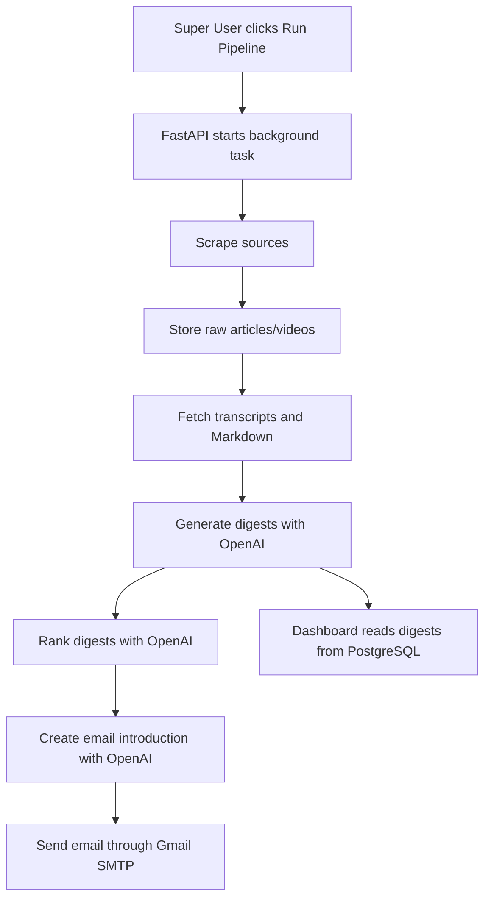

# Project Overview

## What This Project Does

AI News Aggregator is a FastAPI web app that collects AI-related content from multiple sources, stores it in PostgreSQL, creates short AI summaries, ranks articles for a user profile, and sends a daily email digest.

The app has two main ways to use it:

- Web dashboard: users log in and browse summarized AI news.
- Pipeline runner: Super Users can trigger the full collection and digest workflow.

## Main Features

- User signup, login, logout, and session cookies.
- Role-based access control:
  - `normal_user`: can read the news dashboard.
  - `super_user`: can manage users and run the pipeline.
- News scraping from:
  - YouTube RSS feeds.
  - OpenAI News RSS feed.
  - Anthropic RSS feed mirrors.
- YouTube transcript collection.
- Anthropic page conversion to Markdown.
- Digest generation using OpenAI.
- Personalized ranking using OpenAI.
- Email digest generation and sending through Gmail SMTP.
- Admin Panel:
  - View users.
  - Change roles.
  - Activate or deactivate users.
  - Trigger pipeline.
  - View pipeline history.
  - View audit logs.

## Technology Stack

| Area | Technology | Purpose |
| --- | --- | --- |
| Backend | FastAPI | HTTP API and web app server |
| Database | PostgreSQL | Persistent storage |
| ORM | SQLAlchemy | Python classes mapped to database tables |
| Frontend | Static HTML, CSS, JavaScript | Browser UI served by FastAPI |
| LLM | OpenAI API | Summaries, ranking, and email introduction |
| Email | Gmail SMTP | Sends the final digest |
| Containers | Docker Compose | Runs PostgreSQL locally |

## High-Level Flow

## Important Entry Points

- `app/api.py`: FastAPI app, API routes, Admin APIs, frontend serving.
- `frontend/static-desing.html`: login page, news dashboard, Admin Panel.
- `app/daily_runner.py`: full pipeline orchestration.
- `app/runner.py`: runs all scrapers.
- `app/database/models.py`: database table definitions.
- `app/database/repository.py`: common database queries and writes.
- `main.py`: command-line entry point for running the pipeline.

## What A New Developer Should Learn First

1. Read [Architecture](ARCHITECTURE.md).
2. Read [Database](DATABASE.md).
3. Read [Pipeline and Background Jobs](PIPELINE_AND_JOBS.md).
4. Read [API Reference](API.md).
5. Read [Developer Workflows](DEVELOPER_WORKFLOWS.md).
