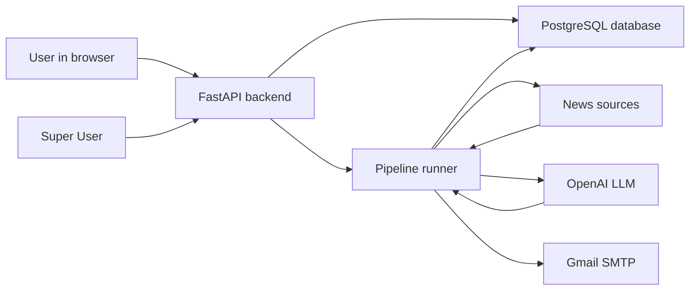

# AI News Aggregator Documentation

Welcome to the project documentation. These files explain the app in simple English so a new developer can understand, run, debug, and extend it.

## Start Here

- [Project Overview](PROJECT_OVERVIEW.md): What the app does and how the parts fit together.
- [Architecture](ARCHITECTURE.md): The main system design and end-to-end flow.
- [Terminology](TERMINOLOGY.md): Beginner-friendly explanations of common terms used in this project.

## Main Feature Docs

- [API Reference](API.md): Backend endpoints, request examples, response examples, and auth rules.
- [Authentication and Admin](AUTHENTICATION.md): Signup, login, sessions, roles, and protected routes.
- [Admin Panel](ADMIN_PANEL.md): Super User setup and admin features.
- [Database](DATABASE.md): Tables, relationships, ORM models, queries, and migrations.
- [LLM Integration](LLM_INTEGRATION.md): OpenAI usage, prompts, response parsing, and token handling.
- [News Providers](NEWS_PROVIDERS.md): YouTube, OpenAI News, Anthropic feeds, and how scraping works.
- [Pipeline and Background Jobs](PIPELINE_AND_JOBS.md): The scraping, processing, digest, and email workflow.
- [Frontend](FRONTEND.md): The static HTML dashboard, UI state, and admin UI behavior.
- [End-to-End Workflow](END_TO_END_WORKFLOW.md): Full journey from signup to final email digest.

## Setup and Operations

- [Environment, Docker, and Deployment](ENVIRONMENT_DOCKER_DEPLOYMENT.md): `.env`, PostgreSQL Docker setup, and deployment flow.
- [Developer Workflows](DEVELOPER_WORKFLOWS.md): Running locally, testing, debugging, and common commands.
- [Logging and Monitoring](LOGGING_MONITORING.md): What is logged and how to observe the app.
- [Troubleshooting](TROUBLESHOOTING.md): Common issues and fixes.

## Code Reference

- [Module Reference](MODULE_REFERENCE.md): File-by-file explanation of the project.
- [Dependencies](DEPENDENCIES.md): Important packages and why they are used.

## Quick Mental Model

In one sentence: the app collects AI news, summarizes and ranks it with OpenAI, stores it in PostgreSQL, shows it in a web dashboard, and can email a digest.
